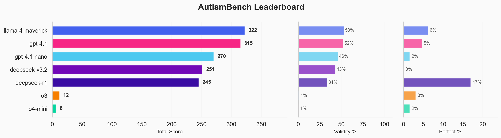
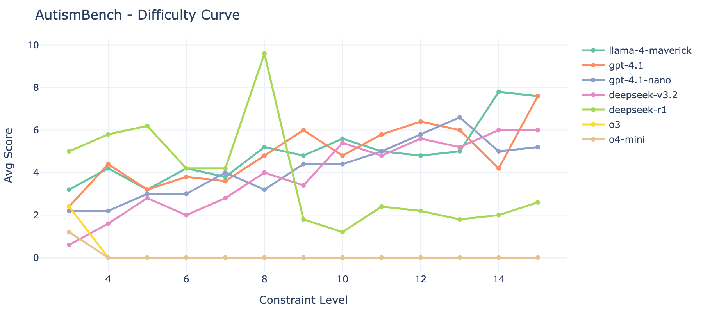
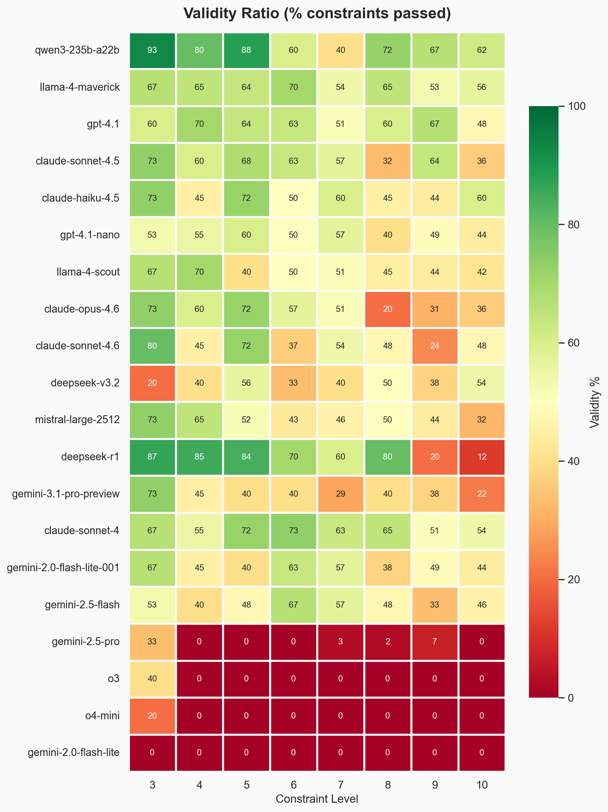

<div align="center">

# AutismBench

**Constraint satisfaction benchmark for large language models.**

[](LICENSE)
[](https://www.python.org/downloads/)

*Write one sentence. Satisfy N rules. No LLM judge. Pure code verification.*

[Leaderboard](#leaderboard) · [How It Works](#how-it-works) · [Quick Start](#quick-start) · [Results](#results) · [Citation](#citation)

</div>

---

> **Created by the Chief of Autism.**
> It tests what autists can, and most models can't.

AutismBench stress-tests **simultaneous constraint satisfaction**, **precision**, **forward planning**, and **zero-tolerance rule adherence**. The model must write a single sentence that satisfies N constraints at once. Start at 3, scale to 30+.

Every constraint is verified **programmatically** - no LLM judge, zero judge bias, fully reproducible.

## Leaderboard

Levels 3-15 | 5 trials per level | temperature 0.0

| # | Model | Score | Validity | Perfect Solve |
|---|-------|------:|:--------:|:-------------:|
| 1 | llama-4-maverick | 322 | 52.7% | 6.2% |
| 2 | gpt-4.1 | 315 | 52.0% | 4.6% |
| 3 | gpt-4.1-nano | 270 | 45.8% | 1.5% |
| 4 | deepseek-v3.2 | 251 | 43.0% | 0.0% |
| 5 | deepseek-r1 | 245 | 33.5% | 16.9% |
| 6 | o3 | 12 | 1.0% | 3.1% |
| 7 | o4-mini | 6 | 0.5% | 1.5% |

> **Note:** o3 and o4-mini score near zero due to response format issues - their reasoning output breaks sentence extraction. This is a known issue being investigated.

<details>
<summary>Additional models (levels 3-10)</summary>

| # | Model | Score | Validity | Perfect Solve |
|---|-------|------:|:--------:|:-------------:|
| 1 | claude-sonnet-4 | 175 | 61.2% | 10.0% |
| 2 | gemini-2.0-flash-lite | 133 | 48.9% | 5.0% |
| 3 | gemini-2.5-flash | 131 | 48.1% | 2.5% |

</details>

## Results





<details>
<summary>Validity heatmap (model × level)</summary>



</details>

## Why "AutismBench"?

The benchmark is designed around cognitive strengths commonly associated with autism:

- **Pattern recognition under constraints** - seeing how 20 rules interact and finding the one solution that satisfies all of them
- **Hyperfocus on detail** - one wrong letter, one extra word, one broken rule = total failure
- **Systematizing** - building a mental system of interlocking rules and working within it precisely
- **Rule adherence without drift** - no "close enough", no rounding off, no approximation
- **Parallel constraint tracking** - holding many rules in working memory at once without losing any

> *"Can your model think like an autist?"* If it can't hold 20 explicit rules without dropping one, it fails.

## How It Works

The model receives a prompt like this:

```
Write a single sentence that satisfies ALL of the following constraints:

1. Contains exactly 8 words
2. Every word starts with a unique letter
3. The 3rd word is a past-tense verb
4. Contains exactly one number (as a digit)
5. The last word is an animal name
```

Valid answer: `Big cats devoured 5 exotic fish near eagle`

Each constraint is binary pass/fail, checked by code. No ambiguity.

### Difficulty Scaling

| Level | Difficulty |
|-------|-----------|
| 3-5 | Warm-up, most models pass |
| 6-10 | Non-reasoning models start failing |
| 11-15 | Only strong reasoning models survive |
| 16-20 | Frontier reasoning models only |
| 21-30 | Approaching NP-hard constraint satisfaction |

### Constraint Categories

18 constraints across 5 categories:

| Category | Examples |
|----------|---------|
| **Structural** | Exact word count, character count, word length at position |
| **Lexical** | Must contain a color / animal / profession / digit |
| **Positional** | First word length, last word suffix, word starts with letter X |
| **Relational** | Unique first letters, ascending word length, acrostic |
| **Meta** | Vowel count, unique letters, word length sum, forbidden letter |

### Scoring

- **+1 point** per satisfied constraint
- **×2 bonus** if ALL constraints satisfied (perfect solve)
- **Validity ratio** = constraints passed / constraints attempted
- **Perfect solve rate** = tasks where every constraint passed

## Quick Start

```bash
git clone https://github.com/chiefautism/autism-bench.git
cd autism-bench
uv sync

echo "OPENROUTER_API_KEY=your-key-here" > .env

# Run benchmark
uv run python main.py

# Specific models
uv run python main.py --models "anthropic/claude-sonnet-4" "openai/gpt-4.1"

# Custom levels
uv run python main.py --min-level 3 --max-level 15 --trials 5

# Generate interactive dashboard
uv run python visualization.py results/autism_bench_results_*.json --save
```

### CLI Options

| Flag | Default | Description |
|------|---------|-------------|
| `--models` | `model_list.py` defaults | Space-separated model IDs (OpenRouter format) |
| `--min-level` | 3 | Minimum constraint count |
| `--max-level` | 25 | Maximum constraint count |
| `--trials` | 10 | Random tasks per level |
| `--temperature` | 0.0 | Sampling temperature |
| `--threads` | 10 | Parallel API threads |
| `--output` | auto-timestamped | Output JSON path |
| `--dry-run` | - | Preview tasks without API calls |

### Estimated Cost

| Models | Levels | Trials | API Calls | Est. Cost |
|--------|--------|--------|-----------|-----------|
| 1 | 3-15 | 5 | 65 | <$1 |
| 10 | 3-25 | 10 | 2,300 | $10-25 |
| 50 | 3-30 | 10 | 14,000 | $100-250 |

## Repository Structure

```
├── main.py              # CLI entry point
├── autism_bench.py       # Core benchmark orchestration
├── constraint_pool.py    # 18 constraints with validators
├── validator.py          # Sentence extraction + validation
├── completions.py        # Thread-safe OpenRouter client
├── model_list.py         # Supported model identifiers
├── visualization.py      # Plotly interactive dashboard
├── utils.py              # Word lists, prompts, helpers
├── pyproject.toml        # Project config (uv)
└── TECH_TASK.md          # Full implementation spec
```

## Why This Benchmark

| Property | AutismBench |
|----------|-------------|
| **Objectively verifiable** | Every constraint = binary pass/fail via code |
| **No LLM judge** | Zero judge bias, fully reproducible |
| **No ceiling** | Combinatorial explosion with more constraints |
| **Cheap** | ~500 API calls per model, $2-5 total |
| **Contamination-resistant** | Random constraint combos = infinite unique tasks |
| **What it tests** | Planning, working memory, precision, constraint satisfaction |

## Citation

```bibtex
@misc{autismbench2026,
    title={AutismBench: Constraint Satisfaction Benchmark for Large Language Models},
    author={Chief of Autism},
    year={2026},
    url={https://github.com/chiefautism/autism-bench}
}
```

## License

MIT
</div>
